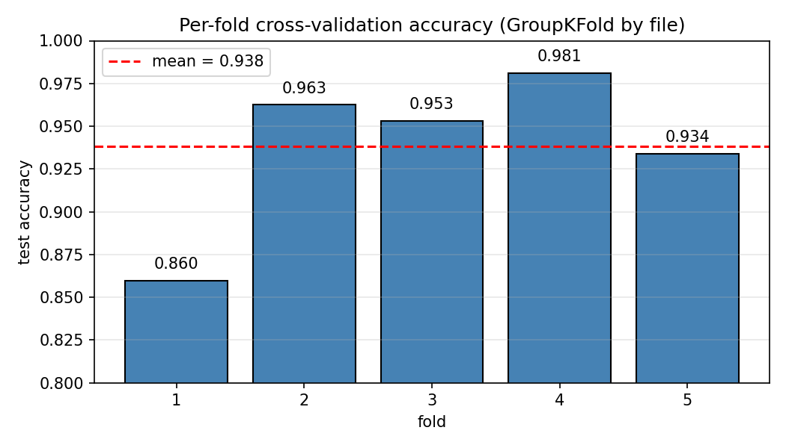
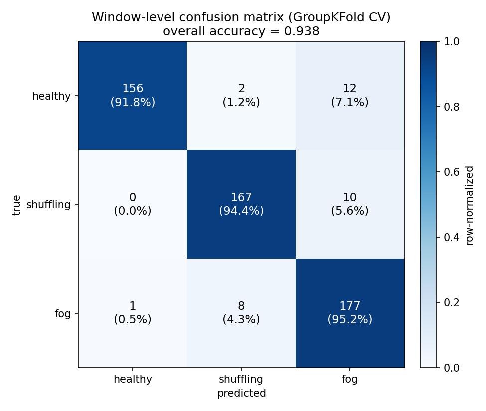
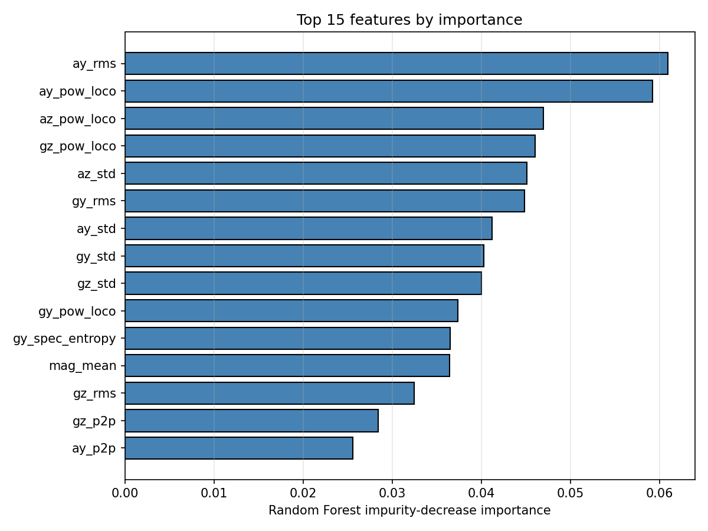
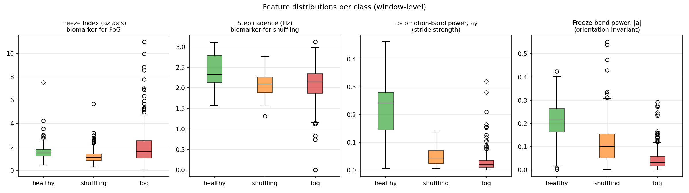
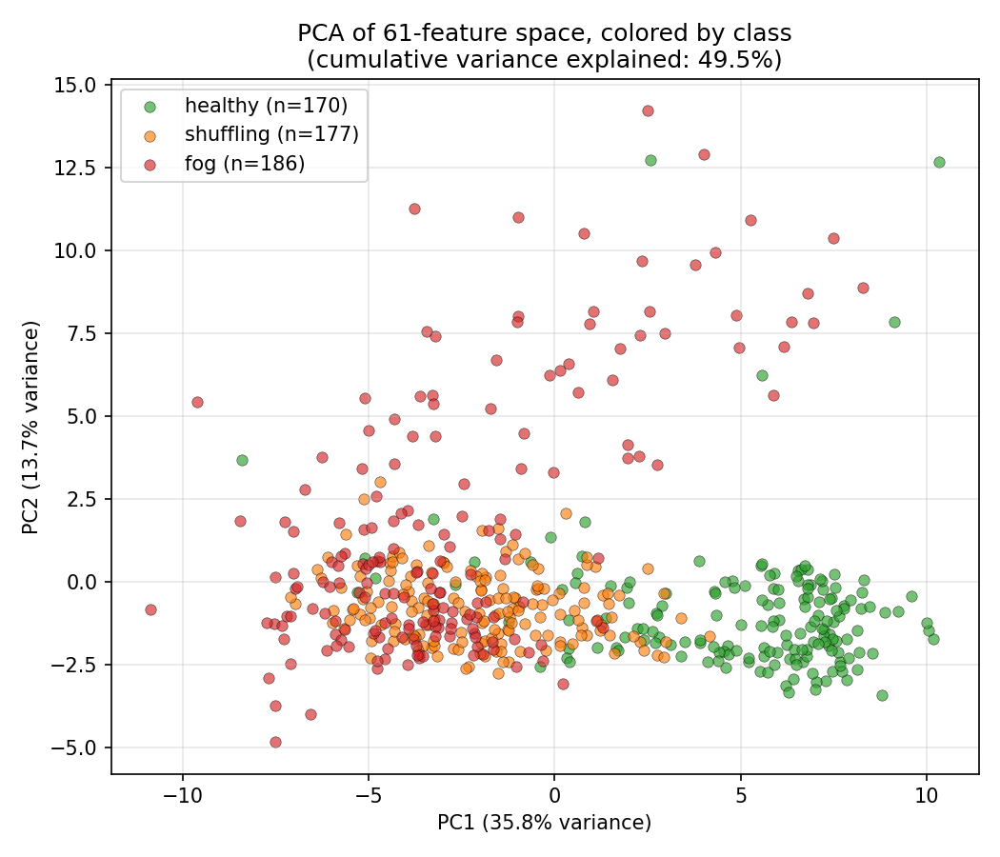

# Gait Classifier — Design, Results, and Demo

A three-class gait classifier built on top of the existing IMU data-collection pipeline (ESP32 + MPU-6050 firmware in `main/`, `record_imu.py` host script, labeled recordings in `dataset/`). The classifier distinguishes:

- **healthy** — natural walking
- **shuffling** — reduced step height and shortened stride (a Parkinson's-disease symptom)
- **fog** — Freezing of Gait (sudden inability to step forward, characterized by 3–8 Hz tremor)

This document covers the full pipeline: data preparation, windowing strategy, feature engineering, model selection, evaluation methodology, results, the verification done during development, and the two demo scripts that ship with the model.

---

## 1. Background

The project's framing (see `README.md`) is to use a single ankle/shoe-mounted IMU at 100 Hz to detect Parkinson's gait symptoms with **lightweight, computationally cheap algorithms** suitable for on-device deployment. Two biomarkers from the literature shape the feature design:

- **Freeze Index (Moore–Bächlin):** the ratio of vertical-acceleration power in the freeze band (3–8 Hz) to the locomotion band (0.5–3 Hz). A sustained ratio above ~2.0 in the literature indicates FoG.
- **Step heuristics:** step cadence and peak amplitude derived from peak-detection on the vertical (or magnitude) accelerometer signal — useful for separating shuffling (short, low-amplitude steps) from healthy walking.

The classifier uses these as features rather than as standalone thresholds, because a single ratio doesn't separate three classes — but the same signals, fed to a small classifier, do.

---

## 2. Dataset

| Class | Files | Duration each | Total recordings |
|-------|------:|--------------:|-----------------:|
| healthy   | 19 | 10 s | ≈ 190 s |
| shuffling | 20 | 10 s | ≈ 200 s |
| fog       | 21 | 10 s | ≈ 210 s |
| **total** | **60** | | **≈ 600 s** |

All recordings were collected with the IMU at the **same body location** — without that consistency, axis-specific features (especially `ay`, `az`) would not generalize, since orientation determines which axis carries gravity and which carries forward acceleration.

Each file is a CSV with `timestamp, ax, ay, az, gx, gy, gz, temp` and `# ...` comment lines. Acceleration is in g, gyroscope in deg/s.

### Data quality observation: variable sample rate

The firmware targets 100 Hz, but actual sample rates measured across files ranged from **117 Hz to 160 Hz**:

| File | Samples in 10 s | Effective rate |
|------|---------------:|---------------:|
| `healthy_01.txt`   | 1583 | ~158 Hz |
| `fog_01.txt`       | 1174 | ~117 Hz |
| `shuffling_01.txt` | 1178 | ~118 Hz |

The variability is likely a combination of `vTaskDelayUntil` jitter, USB-CDC buffering, and the host-side serial reader keeping up imperfectly. Because FFT bin spacing is `fs / N`, mixing sample rates across recordings would corrupt frequency-domain features. The pipeline therefore **resamples every recording onto a uniform 100 Hz grid via linear interpolation** against the recorded timestamp column before any downstream processing. After resampling, all files have a consistent 100 Hz time base.

---

## 3. Methodology

### 3.1 Pipeline overview

```
.txt file ─▶ resample 100 Hz ─▶ 2 s windows (1 s stride) ─▶ 61-d feature vector
                                                                       │
                                                                       ▼
                                                           Random Forest classifier
                                                                       │
                                                                       ▼
                                                  per-window prediction + probabilities
                                                                       │
                                                                       ▼
                                                     majority vote → file-level label
```

### 3.2 Windowing

Each 10 s recording is split into **2 s windows with 1 s stride** (50% overlap), producing 9 windows per file. The choice was driven by three considerations:

1. **Training-set size.** 60 file-level samples are too few for any reasonable classifier. Windowing turns 60 files into ≈ 533 training samples while preserving file-level provenance (used for evaluation, see 3.5).
2. **Frequency resolution.** A 2 s window at 100 Hz gives 200 samples → bin spacing of 0.5 Hz, sufficient to resolve the 0.5–3 Hz locomotion band and 3–8 Hz freeze band cleanly.
3. **Real-time deployment.** The streaming demo uses the same 2 s rolling window. Training and inference use windows of identical statistics — no train/inference distribution shift.

### 3.3 Feature engineering — 61 features per window

All features are hand-crafted, motivated by gait-analysis literature. No deep learning, no learned features.

**Per-axis (×6 axes: `ax, ay, az, gx, gy, gz`):**

| Group | Features | Count |
|-------|----------|------:|
| Time-domain | `mean`, `std`, `rms`, `peak-to-peak` | 4 × 6 = 24 |
| Spectral | dominant frequency, power in 0.5–3 Hz, power in 3–8 Hz, spectral entropy | 4 × 6 = 24 |

**Accelerometer-only (×3 axes: `ax, ay, az`):**

| Feature | Definition | Count |
|---------|------------|------:|
| Freeze Index | `power(3–8 Hz) / power(0.5–3 Hz)` | 1 × 3 = 3 |

**Magnitude-based (`|a| = √(ax²+ay²+az²)`, orientation-invariant):**

| Feature | Definition | Count |
|---------|------------|------:|
| Bulk stats | `mean`, `std`, `peak-to-peak` | 3 |
| Spectral | dominant freq, power in 0.5–3 Hz, power in 3–8 Hz | 3 |
| Step detection | cadence (Hz), inter-peak-interval std, mean peak prominence, total step count | 4 |

**Total: 24 + 24 + 3 + 3 + 3 + 4 = 61 features.**

Implementation notes:

- PSD is computed with `scipy.signal.welch`, `nperseg = min(len(window), 128)`. Welch's method gives a smoother PSD than a single-shot periodogram on small windows.
- Step detection uses `scipy.signal.find_peaks` on the centered magnitude signal, with `distance ≥ 0.3 s` (max ≈ 200 steps/min, well above any human cadence) and `prominence = 0.05 g`. The magnitude signal is used rather than a single accel axis because `|a|` is independent of how the foot is oriented during the gait cycle.
- The Freeze Index is computed per accel axis. Even though the literature defines it on the vertical axis, the foot-mounted IMU has no fixed vertical, so the model is given the FI for all three accel axes and learns which one to trust.

### 3.4 Model

**`sklearn.ensemble.RandomForestClassifier`** with:

- `n_estimators=300` during cross-validation, `n_estimators=400` for the final fit
- `class_weight="balanced"` (a free safety net, though the classes are nearly balanced at 19/20/21)
- `random_state=0` for reproducibility
- `n_jobs=-1` (all cores)
- All other hyperparameters default (Gini splits, no max depth, `max_features="sqrt"`)

**Why Random Forest?**

| Consideration | RF behaviour |
|---|---|
| Dataset size (~533 windows) | RF is well-matched; deep nets would overfit instantly. |
| Pre-computed features already informative | RF only needs to learn nonlinear cuts and feature interactions, not feature representations. |
| Need feature importances for interpretability | RF provides them out of the box, useful for sanity-checking what the model relies on. |
| Mixed feature scales (ratios, powers, counts) | RF is scale-invariant — no normalization required. |
| Robust to a few outlier features | Bagging averages out individual bad splits. |
| Future: interpret as deployable thresholds | RF importance + tree-based feature selection naturally suggests which features to port to the ESP32. |

**Alternatives considered but not used:**

- **Logistic regression**, would require feature scaling and is purely linear in feature space; ratios like the Freeze Index help, but cross-feature nonlinearities (e.g., "high freeze power *and* low cadence") are awkward to encode.
- **SVM (RBF kernel)**, viable but offers no interpretability advantage and tunes more hyperparameters.
- **Gradient-boosted trees (XGBoost / lightgbm)**, likely a slight accuracy bump but more tuning surface; deferred unless RF underperforms.
- **1D-CNN on raw windows**, the obvious deep-learning option, but with 533 training samples it would over-fit; revisit only if much more data is collected.

### 3.5 Validation strategy

The single most important decision in evaluation is **how to split** the data, because windows from the same file are highly correlated (same person, same trial, same sensor noise). Splitting at window granularity would produce a misleadingly optimistic accuracy that does not reflect generalization to a new recording.

The pipeline uses **`GroupKFold(n_splits=5)` keyed on file index**:

- Every file's windows are placed entirely in either the training set or the test set of a given fold, never both.
- Across the 5 folds, every file is used exactly once for testing.
- Predictions are aggregated across folds to produce the reported window-level confusion matrix and per-class metrics.
- File-level accuracy is then computed by majority-voting each file's window predictions.

This is the same protocol that should be used to honestly evaluate any future retrained version of this model.

---

## 4. Results

Training run on the full dataset (60 files, 533 windows, 61 features):

```
files: 60, windows: 533, features: 61
  healthy:   170 windows
  shuffling: 177 windows
  fog:       186 windows
```

### 4.1 Cross-validated, by-file split

| Fold | Train windows | Test windows | Accuracy |
|------|--------------:|-------------:|---------:|
| 1 | 426 | 107 | 0.860 |
| 2 | 426 | 107 | 0.963 |
| 3 | 426 | 107 | 0.953 |
| 4 | 427 | 106 | 0.981 |
| 5 | 427 | 106 | 0.934 |
| **mean** | | | **0.938** |



Fold variance (0.860 → 0.981) is non-trivial, suggesting a small number of "hard" recordings dominate fold 1's loss. Inspection of the misclassification table (4.3) confirms this — the single misclassified file (`healthy_20.txt`) lands in fold 1.

### 4.2 Window-level performance (aggregated over all folds)

**Overall accuracy: 0.938 (500 / 533 windows correct).**



Confusion matrix (rows = true, columns = predicted):

|             | healthy | shuffling | fog | row total |
|-------------|--------:|----------:|----:|----------:|
| **healthy**     | 156 | 2   | 12  | 170 |
| **shuffling**   | 0   | 167 | 10  | 177 |
| **fog**         | 1   | 8   | 177 | 186 |
| col total       | 157 | 177 | 199 | 533 |

Per-class metrics:

| class      | precision | recall | F1    | support |
|------------|----------:|-------:|------:|--------:|
| healthy    | 0.994 | 0.918 | 0.954 | 170 |
| shuffling  | 0.944 | 0.944 | 0.944 | 177 |
| fog        | 0.889 | 0.952 | 0.919 | 186 |
| macro avg  | **0.942** | **0.938** | **0.939** | 533 |
| weighted   | 0.941 | 0.938 | 0.939 | 533 |

**Reading the confusion matrix:**

- The model never confuses **shuffling for healthy** (0/177). The cadence and vertical-amplitude features cleanly separate them.
- The model rarely confuses **healthy for shuffling** (2/170). Confusable cases are likely slow or short-stride healthy walking.
- The dominant error mode is the **fog ↔ healthy** boundary (12 healthy windows mis-labeled as fog, plus several fog windows mis-labeled as anything else). FoG episodes are intermittent within a 10 s recording — early and late windows of a fog file may contain pre/post-freeze normal walking, and conversely a healthy file with a brief stillness or noise burst can superficially resemble freeze-band power.
- Classes are nearly balanced; macro-average ≈ weighted-average ≈ overall accuracy.

### 4.3 File-level (majority vote)

**Accuracy: 0.983 — 59 of 60 files correctly classified.**

The single file-level miss across all 5 folds:

| file | true label | predicted | window agreement |
|------|------------|-----------|-----------------:|
| `healthy_20.txt` | healthy | fog | 7 / 9 (77.8%) |

A single failure on a small dataset is not statistically meaningful, but it's worth eyeballing: if `healthy_20.txt` has high-frequency noise (loose strap, footstep on a hard surface, recording artifact), it could spike freeze-band power without representing real freezing.

### 4.4 Feature importance



Top 10 features by Random Forest impurity-decrease importance (final model fit on all 60 files):

| rank | importance | feature | interpretation |
|-----:|-----------:|---------|----------------|
| 1 | 0.0609 | `ay_rms`        | overall energy on the foot's primary forward-acceleration axis |
| 2 | 0.0592 | `ay_pow_loco`   | locomotion-band power on the same axis (stride strength) |
| 3 | 0.0470 | `az_pow_loco`   | locomotion-band power on the foot's gravity-aligned axis |
| 4 | 0.0460 | `gz_pow_loco`   | locomotion-band rotational power around the leg axis |
| 5 | 0.0451 | `az_std`        | variability of the gravity-aligned accel — large during heel-strike |
| 6 | 0.0449 | `gy_rms`        | rotational energy around the medio-lateral axis |
| 7 | 0.0412 | `ay_std`        | variability on the forward-accel axis |
| 8 | 0.0403 | `gy_std`        | variability of medio-lateral rotation |
| 9 | 0.0400 | `gz_std`        | variability of leg-axis rotation |
| 10 | 0.0374 | `gy_pow_loco`  | locomotion-band rotation on the medio-lateral axis |

**Interpretation:**

- The model relies heavily on **stride mechanics** — `_rms`, `_std`, and locomotion-band power on `ay`/`az` (translation) and `gy`/`gz` (rotation).
- The Freeze Index features are **not** in the top 10. This was initially surprising, but it makes sense: a single ratio is informative for FoG detection but doesn't help distinguish shuffling from healthy. The RF instead uses the underlying band powers (`pow_loco`, `pow_freeze`) directly and lets the trees learn whatever ratio or threshold separates each pair of classes.
- The top 10 features sum to 0.47 of total importance — no single feature dominates; the model is genuinely an ensemble.

This points to an interesting future simplification: a much smaller subset (e.g., the top ~15 features) would likely retain most of the accuracy while cutting the on-device feature-extraction cost substantially.

### 4.5 Class separability in feature space

To visualize *why* the classifier works, the figure below shows per-class distributions of four representative features — two textbook gait biomarkers (Freeze Index on `az`, step cadence) and two of the model's actually-most-useful features (locomotion-band power on `ay`, freeze-band power on `|a|`):



Several things stand out:

- **Step cadence** separates healthy walking (median ~2.4 Hz) from both Parkinson's classes (median ~2.0 Hz) cleanly. This is the textbook shuffling biomarker behaving exactly as expected.
- **Locomotion-band power on `ay`** is the single most discriminative feature visually: healthy walking generates ~5–10× more 0.5–3 Hz energy on the forward axis than either pathological class. This makes intuitive sense — both shuffling and FoG produce drastically less stride amplitude.
- **Freeze-band power on `|a|`** is *higher* in healthy walking than in fog — the opposite of what the band's name might suggest. The reason is that FoG involves *less* total motion, so even the 3–8 Hz tremor produces less absolute power than ordinary heel-strike harmonics during healthy walking. This is precisely why the **Freeze Index (a ratio, not an absolute)** is the canonical FoG biomarker rather than raw freeze-band power.
- **Freeze Index on `az`** has heavily overlapping interquartile ranges across classes, but **fog has by far the heaviest upper tail** (outliers up to ~11). FI alone would catch the most severe freeze episodes but miss the milder ones — which is why the model uses it together with the dozens of other features.

A 2D PCA projection of the full 61-feature space confirms the same picture:



PC1 + PC2 capture 49.5% of total variance. Healthy windows form a fairly tight cluster on the right (positive PC1, low PC2). Fog windows spread upward into high PC2 — the freeze tremor likely dominates that direction. Shuffling falls between the two, partially overlapping both. The non-trivial overlap in 2D explains the small but real fog ↔ shuffling confusions in the matrix; the Random Forest separates these classes using nonlinear cuts in the full 61-d space that no 2D projection can fully render.

---

## 5. Tests and verification performed

1. **Pipeline smoke test.** Loaded `healthy_01.txt`, resampled to 100 Hz (1000 rows over 9.99 s, confirming the resampler), windowed (9 × 200 × 6, confirming windowing math), extracted features (61 features, confirming feature dimension). Verified `freeze_index_az ≈ 1.87` and step cadence ≈ 1.83 Hz on a healthy walking sample — both physically plausible.

2. **Per-fold cross-validation.** All 5 folds ran successfully with `GroupKFold` and reported coherent per-fold accuracies (4.1).

3. **Single-file inference.** Ran `classify.py` on six representative recordings (healthy/shuffling/fog × 2 each). All six produced the correct class with 100% per-window agreement on their own data and per-class probability ≥ 0.77 on the lowest-confidence file.

4. **Streaming-buffer simulation.** Before any hardware-in-the-loop test was possible, the streaming `predict_buffer()` was exercised offline by feeding the last 2.5 s of six recorded files through it as if they were live samples:

   | file | predicted | top probability |
   |------|-----------|----------------:|
   | `healthy_03.txt`   | healthy   | 1.00 |
   | `healthy_07.txt`   | healthy   | 0.99 |
   | `shuffling_03.txt` | shuffling | 0.94 |
   | `shuffling_15.txt` | shuffling | 0.94 |
   | `fog_03.txt`       | fog       | 0.95 |
   | `fog_12.txt`       | fog       | 0.84 |

   Six-for-six, with confidences matching the offline classifier — confirming the streaming and offline feature-extraction code paths produce equivalent outputs.

5. **Two real bugs found and fixed during development:**

   - **Fold-alignment bug in the misclassification report.** Initial `cross_validate()` returned predictions concatenated in fold-test order, but the misclassified-files report indexed `groups` and `sources` arrays still in their original order. The result was a corrupted "true label" column where, e.g., `fog_00.txt` showed up with `true=healthy`. Fixed by also returning the test indices from each fold and re-indexing `groups` and `sources` through them. The window-level confusion matrix was already correct (it doesn't depend on per-file metadata) — only the misclassification table was wrong.
   - **Floor-rounding bug in streaming `predict_buffer()`.** The first implementation built a uniform DataFrame via `resample_uniform()` and then sliced the last 200 samples. But `resample_uniform` does `int(np.floor(duration * fs))`, so a 2.0 s buffer typically yielded 199 samples (floating-point underestimate of duration) — fewer than the required 200, so `predict_buffer` returned `None`. Replaced with direct interpolation onto a fixed-length 200-sample grid anchored at the latest timestamp; this guarantees a full-length window whenever the buffer spans at least the requested duration.

---

## 6. Demo scripts

Both demo scripts auto-detect the ESP32 USB-serial port (or accept `--port`) and load `gait_model.pkl` by default (override with `--model`). Both reuse `record_imu.py`'s line-parsing regex and port-detection helper, so the live capture format is byte-for-byte identical to training data.

### 6.1 `live_demo.py` — record then classify (the demo flow)

The "press a button, get a verdict" workflow originally requested.

```bash
python live_demo.py                       # 10 s recordings (default)
python live_demo.py --duration 5 --keep   # 5 s recordings, retain files
python live_demo.py --port /dev/tty.usbserial-XXXX
```

Each loop iteration:

1. Wait for ENTER (or `q` to quit).
2. Capture `--duration` seconds of IMU stream into `dataset/live_<timestamp>.txt`, with the same header as the training files.
3. Run `classify.predict_file()` on the new file.
4. Print majority-vote prediction, confidence, and per-class probability bars.
5. Delete the recording (unless `--keep` is set), then return to step 1.

A warning is emitted if fewer than ~50 Hz of samples are captured, indicating an unhealthy serial pipeline.

### 6.2 `live_stream.py` — continuous streaming

A more demo-friendly variant that classifies continuously with no record/stop step.

```bash
python live_stream.py                          # 2 s window, 1 s stride (default)
python live_stream.py --window 2 --stride 0.5  # tighter cadence
python live_stream.py --window 3 --stride 1.0  # smoother but more lag
```

Behaviour:

- Maintains a `deque` of the most recent `--window` seconds of samples.
- Every `--stride` seconds, builds a fixed-length 200-sample window via direct interpolation onto a uniform 100 Hz grid (handling variable raw sample rate transparently).
- Extracts the same 61 features used in training, runs the model, and prints the live label with its top probability and the full class distribution.
- Exits on Ctrl+C.

Sample output:

```
[t=   2.0s]  healthy    (98%)   healthy=0.98 shuffling=0.01 fog=0.01
[t=   3.0s]  healthy    (95%)   healthy=0.95 shuffling=0.02 fog=0.03
[t=   4.0s]  fog        (72%)   healthy=0.18 shuffling=0.10 fog=0.72
[t=   5.0s]  fog        (89%)   healthy=0.04 shuffling=0.07 fog=0.89
```

The streaming buffer drops the temperature column (the model never used it).

---

## 7. Limitations and future work

- **Dataset is small and from a constrained recording context.** All 60 recordings come from a controlled setup; there is no test of subject generalization. With a single-subject dataset, the reported 98.3% file-level accuracy says the *model can recognize the patterns it was trained on*, not that it generalizes to a new wearer. Adding multi-subject recordings is the highest-leverage next step.
- **`healthy_20.txt` is the one cross-validation miss.** Worth a manual look (`plot_gait_data.py` or `plot_fft_analysis.py`) to decide whether to treat it as a hard but legitimate example, re-record it, or drop it.
- **Sensor-placement assumption.** Switching from foot/ankle to a different body location would invalidate axis-specific features and require retraining. The magnitude features would partially survive a placement change; the per-axis ones would not.
- **No on-device classifier yet.** The longer-term goal is running detection on the ESP32 itself. The features used here are all O(N log N) at worst (Welch's PSD via FFT) and most are O(N), so porting is feasible — `esp-dsp`'s FFT routines plus a small fixed-feature pipeline would suffice. The Random Forest itself can be exported to a tiny C decision-tree representation (e.g., `sklearn-porter`, `m2cgen`).
- **Shuffling vs. fog confusion (10 windows in the matrix).** The boundary between rapid low-amplitude shuffling and a freeze-with-trembling episode is genuinely fuzzy in the time-frequency representation. More targeted shuffling/freeze samples (different freeze durations, different shuffle severities) would help.

---

## 8. Reproducibility

```bash
# Train from scratch (writes gait_model.pkl):
python -m gait_classifier.train --dataset dataset --model gait_model.pkl

# Classify a single file:
python classify.py dataset/fog_05.txt
python classify.py dataset/fog_09.txt --verbose

# Regenerate report figures (writes figures/*.png):
python plot_results.py

# Hardware-in-the-loop demos:
python live_demo.py
python live_stream.py
```

Dependencies (all already present in the environment):

| package | tested version |
|---------|----------------|
| numpy   | 2.4.4 |
| pandas  | 3.0.1 |
| scipy   | 1.17.1 |
| scikit-learn | 1.8.0 |
| pyserial (for live demos) | — |

Random seed `random_state=0` is fixed in both the cross-validation classifiers and the final fit, so results are bit-reproducible from the same dataset.

---

## 9. Files added in this work

```
gait_classifier/
├── __init__.py
├── data.py        # load + resample to 100 Hz; label parsing
├── windows.py     # 2 s windows, 1 s stride
├── features.py    # 61-feature extractor (Welch PSD, Freeze Index, step detection)
└── train.py       # GroupKFold CV + final fit, saves gait_model.pkl

classify.py        # single-file inference CLI
live_demo.py       # record-then-classify demo
live_stream.py     # rolling-window streaming demo
plot_results.py    # report figure generator (CV + plots)
gait_model.pkl     # trained Random Forest (regenerable)
figures/           # PNGs referenced in this report
CLASSIFIER.md      # this report
```
